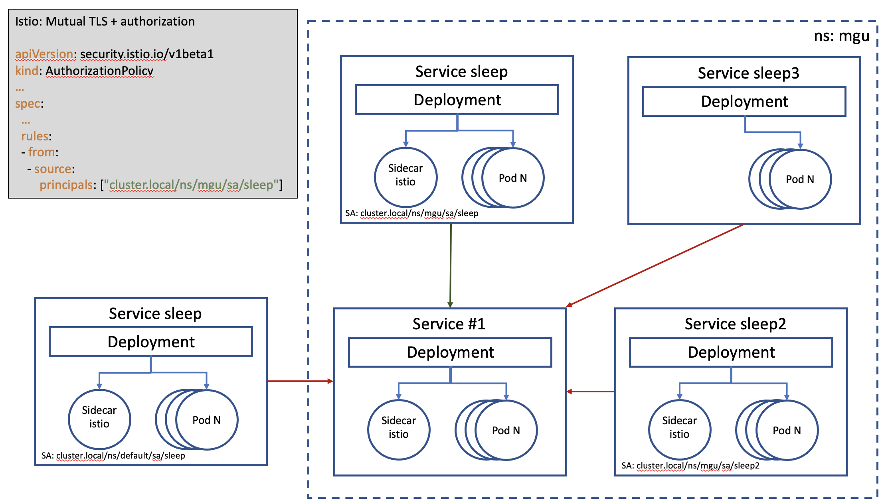

# istio and mTLS - the theory

Let's start with a bit of theory, how does the mTLS work? in fact the connection is established not between our containers but between our istio side car
containers. when the connection is established a TLS handshake is started and of course the certificates used during
this handshake are managed by istio, so available in the side car only)

doc here https://istio.io/latest/docs/concepts/security/#mutual-tls-authentication

# istio and mTLS - labs

First let's create a namespace: **kubectl create ns mgu**.

In this namespace we will deploy a **sleep** application from which we will run curl commands,
and we will deploy a **httpbin** application that will reply to the curl commands.

Now let's deploy the httpbin application: **kubectl apply -f ~/istio-1.16.0/samples/httpbin/httpbin.yaml -n mgu**

Now let's verify what has been created: **kubectl get all -n mgu**

We have one deployment, one service and one pod made of one container. Wait? Where is the istio container?
We have just made a simple deployment, and at any time we have put istio in the loop.

So let's remove what we have done **kubectl delete -f ~/istio-1.16.0/samples/httpbin/httpbin.yaml -n mgu**

Now, let's create it again indicating we want to istio sidecar container.
**kubectl apply -f <(istioctl kube-inject -f ~/istio-1.16.0/samples/httpbin/httpbin.yaml) -n mgu**

When listing the elements of the namespace, we now see that our application POD is made of two containers.
When getting the description of that POD (**kubectl describe pod httpbin -n mgu)** if will see two containers:

- **httpbin** that is our application container
- **istio-proxy** that is the istio container

So far so good, but the command line is not very user friendly. We'll see later in this document that it can
be shortened and simplified. But, for the purpose of this demonstration we will keep using the hard way :)

Now, we deploy the **sleep** application.

In a first time we will deploy it without istio **kubectl apply -f ~/istio-1.16.0/samples/sleep/sleep.yaml -n mgu**

We verify that now we have two containers in the **httpbin** pod and only for the **sleep** pod **kubectl get pods -n mgu**.

We will first verify that a simple addition of the istio sidecar does not alter the nominal behavior,
from the sleep container the **curl http://httpbin:8000/headers** command should work and return the list of headers.

Now let's activate the mTLS on our **mgu** namespace **kubectl apply -f 00-02-mutual-tls.yaml -n mgu**.
From the sleep container we run the curl command again but now we have an error => curl: (56) Recv failure: Connection reset by peer

Here the TLS handshake failed because our **sleep** pod does not have the istio sidecar in it able to process it.
So let's create the sleep pod with istio.

First we delete the old one **kubectl delete -f ~/istio-1.16.0/samples/sleep/sleep.yaml**

And we create it with istio **kubectl apply -f <(istioctl kube-inject -f ~/istio-1.16.0/samples/sleep/sleep.yaml) -n mgu**
here we have also targeted the mgu namespace but it has no impact but the ability to use the short URL :)

So we connect again the sleep container: **kubectl exec -it service/sleep -n mgu -- sh**

We run again **curl http://httpbin:8000/headers** and this is a success.

### one step further

During the theory we told that a TLS handshake is established at the connection. There is another check that is
done at the same time. In fact the certificate that is sent by the caller contains its identity. So, we
can also restrict the usage of a service to a set of callers.

The istio identity of an application is based on the ServiceAccount used during the application registration.
So it is recommended to use a SA (ServiceAccount) for all kube application registration. Here the documentation about
how istio builds the principal https://istio.io/latest/docs/reference/config/security/authorization-policy/#Source

So right now we have a **sleep** application with an identity, I have duplicated its YAML file and registered the exact
same code under another application name and of course using another SA.

**kubectl apply -f <(istioctl kube-inject -f 00-04-sleep2.yaml) -n mgu**

We connect to **sleep** and **sleep2** containers and target **http://httpbin:8000/headers**, both of them work.

Now let's define the fine authorization policy **kubectl apply -f 00-03-fine-policy.yaml** (here no namespace because it
is set in the YAML file).

If we run again the curl command from the two sleep containers, one of the same will fail (the one from sleep2). If you pay
attention, the error received from sleep2 is not the same as previous. Here we have a RBAC error.

### some more info on the generated identity

If you have paid attention to the **00-03-fine_policy.yaml** file you have noticed that the principal also contains
the name of the namespace. It means that if we deploy the **sleep** application linked to the **sleep** SA (with the istio
sidecar container) on the default namespace, then the command **curl httpbin:8000/headers** will fail.

This is resumed in the following picture:

# simpler istio injection

During this tutorial, we have manually injected the istio sidecar in each of our kube pod registration.
We can simplify it by telling istio to supervise a namespace.

First let's delete our application **kubectl delete -f 00-01-application.yaml -n mgu**.
And let's ask istio to analyze our **mgu** namespace: **istioctl analyze -n mgu**.
We are told that we haven't define anything regarding istio on this namespace.
So if we know that we will not rely on istio we can mark it as not supervised, this way a
further analyze will not raise any warning.

But, we want such supervision, so we simply add a label like mentionned in the warning
**kubectl label namespace mgu istio-injection=enabled**.

And now, let's just create our application again **kubectl apply -f 00-01-application.yaml -n mgu**.
We can verify that this pod contains two containers **$kubectl get all -n mgu**.

So now, we are able to use simple commands to inject istio sidecar in our pods :)
