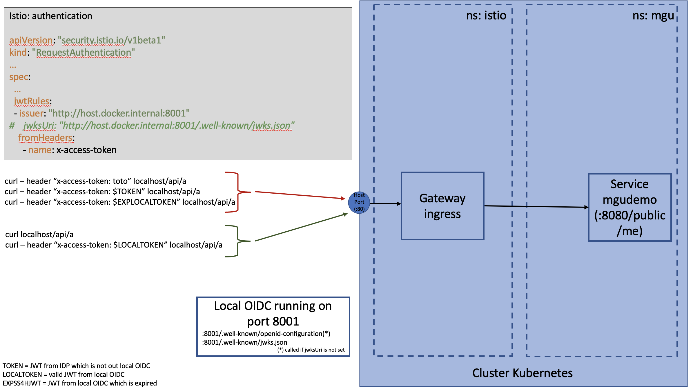

# Purpose

Here we will demonstrate how we can secure an application that has no security filter in its code.

The protection we will provide rely on istio, we will make sure that each request has a valid JWT in
its headers.

Here is the architecture we will put in place

# Pre-requisite

This sample is run on docker desktop with kubernetes enabled and istio installed.

We also must have a local application that exposes a web application. In my case it is a SpringBoot
application that runs on port **8080** and exposes a public endpoint endpoint **/public/hello**.
See [demo app](../resources/springboot-demo).

We also assume that we have an OIDC compliant application that runs on our local machine. On my machine this
application runs on port **8001**.

## Initial verifications

## OIDC provider

Here are the endpoints that are addressed by istio when validating a JWT: **.well-known/openid-configuration** and the
endpoint corresponding to the jwks_uri endpoint. In my case, it is **.well-known/jwks.json**.

Now, we can check that those two endpoints are alive (we assume that if they are alive, they are returning correct values).

We run first **http :8001/.well-known/openid-configuration**, we must have a valid response and then
**http :8001/.well-known/jwks.json** that must returns us the list of keys used to validate a token.

# The tests

## The application

In the [previous sample](../00-mTLS-basics), we have learned to manual activate istio on a namespace. Here we are going
a step further and your first yaml file will create the namespace and apply the label that will activate the injection
of the istio sidecar containers in our new namespace.

Let's create quite everything by running **kubectl apply -f 01-01-application.yaml**.

It creates my app pod based on my local image **mgu/istio-mgu-spring-security-oauth2**. Here we can verify that the sidecar istio container
is injected to our application pod. If we run **kubectl get pod $(kubectl get pod -l app=mgudemo -n mgu -o jsonpath={.items..metadata.name}) -n mgu**
we see that we have two containers.

We can validate it by accessing the description of our pod **kubectl describe pods $(kubectl get pod -l app=mgudemo -n mgu -o jsonpath={.items..metadata.name}) -n mgu**
we give us two containers and one of them is from istio.

We have also exposed our application through a **Service/VirtualService** and defined it in the Gateway to make it reachable from outside
kubernetes.

Now we can verify there is no protection at all:

- **http :80/public/hello** returns the value **hello world**
- **http :80/public/hello "x-access-token: toto"** also returns the same value (here we only verify that the presence of the header we will use
  has no impact on the non protected application)

## The security

First we need to run our OIDC system on the local machine. It listens on port 8001.

Let's add a piece of security. We will configure istio to process the authentication of the user using
a JWT that is in the HTTP header **x-access-token**, and we define our trusted IDP as **http://host.docker.internal:8001**.

**kubectl apply -f 01-02-security-authentication.yaml -n istio-system**

In that file we have defined a **RequestAuthentication** that is defined in the **istio-system** namespace. otherwise
it will not be taken into account. We configure the gateway to extract the principal of the request from
a header **x-access-token** and we also define what IDP we trust.

When running this command, two calls are made to our local IDP:

- one on the **<issuer>/.well-known/openid-configuration**
  URL (OIDC convention)
- and one on the URL returned in the **jwks_uri** field

Note that if you already know this JWKS URL you can also put it in the yaml file and it will avoid the first call to the openid configuration.

Now let's check what impact it has on our application. We will first retrieve a valid token from our local IDP.

**http :80/public/hello "x-access-token: fake"** returns a **401** error.

**http :80/public/hello "x-access-token: <VALID_LOCAL_TOKEN>** returns a **200** return code with a correct body.

Now let's get a valid token but from another IDP.

**export TOKEN=$(curl https://raw.githubusercontent.com/istio/istio/release-1.16/security/tools/jwt/samples/demo.jwt -s)**

If we run the **http :80/api/a "x-access-token: $TOKEN** then we have a **401** error (the error message indicated that
the issuer is not configured, it means that the issuer in the JWT (ie. \*iss\*\* claim) is not configured to be trusted).

So far so good, but let's process a request without any header. **http :80/public/me** also returns a **200**
status code. It's a shame :(

But in fact that is normal. The file we have injected is about authentication, so it is able to validate any
authorization inputs, but if none is present it has not the responsibility to deny a request. In order to
do so, we will use a policy to deny all request that do not contain any principal (ie. any authenticated user).

So in that case, our policy will deny all data that do not own a principal and our RequestAuthentication will
make sure that the principal is built from a JWT emitted by a trusted IDP.

Here the link that explains how the authorhization is processed https://istio.io/latest/docs/concepts/security/#authorization
by istio.

**kubectl apply -f 01-03-security-policy.yaml -n istio-system**

We can now run any request we want.

**http :80/public/me** will return a **403** status code with message **RBAC: access denied**

**http :80/public/me "x-access-token: toto"** will return a **401** status code with
message **Jwt is not in the form of Header.Payload.Signature with two dots and 3 sections%**

**http :80/public/me "x-access-token: <JWT_from_untrusted_idp>"** will return a **401** status code with
message **Jwt issuer is missing%**

**http :80/public/me "x-access-token: <JWT_from_trusted_idp>"** will return a **200** status code

# Clean up

kubectl delete -f 01-02-security-authentication.yaml -n istio-system

kubectl delete -f 01-03-security-policy.yaml -n istio-system

kubectl delete ns mgu
