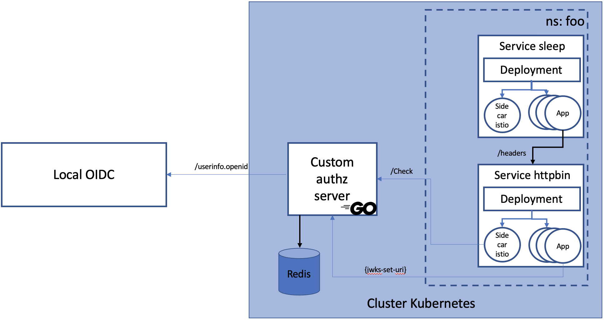
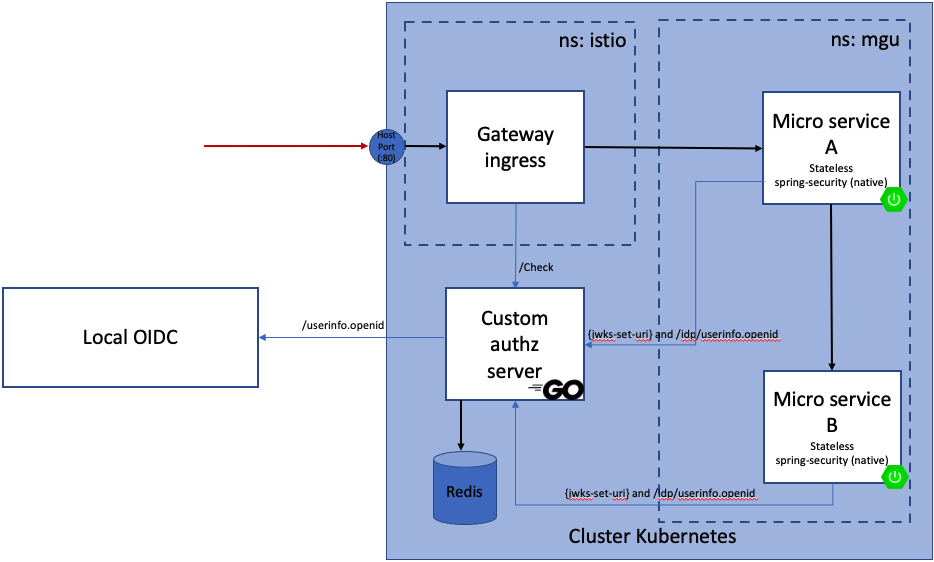

# Getting Started

Regarding the **AuthorizationPolicy** there are mainly two actions: **DENY** or **ALLOW**.
The priority of the **DENY** action is higher than the one of the **ALLOW**. It means that when many
rules match the same request, if one of them denies the request, then the request is denied.

In fact there is a third option which is **CUSTOM** that allows us to use our own implementation
regarding authorization. During this tutorial we will see how to deploy our own implementation of
the authorization server.

During the first part of the tutorial we will cover the "basic" behaviour by validating requests.

In a second step, we will see how we could enhance this in order to bring micro-services architecture
to an old system where the IDP is not scalable at all.

In order to run those scenario, we need to have a local OIDC server configured with two users.
One of those user will have the authority P_XXX_USER and the other one will not have this authority.

# Create the private and public keys

Even if my keys are not official, to store them on GitHub raises security issues. So here are the commands
to generate them:

- **openssl genrsa -out private_key_mgu.pem 2048**
- **openssl rsa -in private_key_mgu.pem -pubout -out public_key_mgu.pub**

# Build the authz docker image

We will code our auhtorization server in **Go**. It is inspired by the [istio sample](https://github.com/istio/istio/tree/release-1.16/samples/extauthz).

A full description of what the Go program does is available [here](ext-authz.md).

Here is how to create the docker image for this **go** program: **docker build -t mgu/go-authz-ext .**

# Test with a basic application

## Kube PODs creation

In order to test our custom service, we will use sample apps provided by the **istio** installation.

Here is what we will put in place.

We will connect to the **sleep** service to send HTTP requests to the **httpbin** service.

In fact the sleep POD could be defined without the istio sidecar container.

**kubectl create ns foo**

**kubectl label namespace foo istio-injection=enabled**

**kubectl apply -f ~/istio-1.16.0/samples/httpbin/httpbin.yaml -n foo**

**kubectl apply -f ~/istio-1.16.0/samples/sleep/sleep.yaml -n foo**

### First test

Here we will test our application without any security. Just to observe the default behavior.

We put in a var the id of the sleep POD

**PODID="$(kubectl get pod -l app=sleep -n foo -o jsonpath={.items..metadata.name})"**

I run a curl from this POD

**kubectl exec $PODID -c sleep -n foo -- curl http://httpbin:8000/headers**

It returns 200 which is normal because we have not defined any security policy.

## Activation of the authz service

Let's run **kubectl apply -f 02-01-go-authz-service.yaml**

This YAML file deploys everything needed by our authorization service. For a full desciption of what
it does, please refer to the [documentation](ext-authz.md).

This service can be registered in any namespace, and it does not require the istio sidecar.

### Configuration of the mesh

We need to register our custom authz service by updating the config map of istio.

Run **kubectl edit configmap istio -n istio-system** and add this **extensionProviders** section.

    data:
      mesh: |-
        extensionProviders:
        - name: "mgu-go-ext-authz-grpc"
          envoyExtAuthzGrpc:
            service: "mgu-go-ext-authz.default.svc.cluster.local"
            port: "9000"

### Registration of our authorization policy

So we have created our authorization server application inside kube. We have also created an entry in the istio configuration to
target our authorization server. We now need to update our istio configuration in order to protect our **sleep** service by invoking
our custom authorization server.

Run **kubectl apply -f 02-02-policy.yaml**

For information the name of the provider inside the YAML file must match the name of the provider we have defined in the istio config map.

### Second round of tests

We can tail the logs of the **ext_authz** service to follow what is happening **kubectl logs -f "$(kubectl get pod -l app=mgu-go-ext-authz -o jsonpath={.items..metadata.name})" -c ext-authz**

Now let's run the same test as before (ie. a single curl request without any header expected by our authorization server).

**kubectl exec $PODID -c sleep -n foo -- curl -v http://httpbin:8000/headers** The result of this request is a **403** with the message **denied by ext_authz**. If we look at the logs of our **ext-authz**
container, we also see that our component denid the request.

Now retrieve a token from your local OIDC and set it into a variable called MOCKTOKEN. Now let's process the same curl request but injecting what is expected by the
authorization server. Here we can use the JWT corresponding to whatever user as long as it is known. We can do this because there is no restriction on authorities.
**kubectl exec "$(kubectl get pod -l app=sleep -n foo -o jsonpath={.items..metadata.name})" -c sleep -n foo -- curl "http://httpbin:8000/headers" -H "x-access-token: $MOCKTOKEN" -s**

This call is ok and returns the list of headers.

Now let's see what happens with a valid token but from an untrusted issuer.

**export TOKEN=$(curl https://raw.githubusercontent.com/istio/istio/release-1.16/security/tools/jwt/samples/demo.jwt -s)**

**kubectl exec "$(kubectl get pod -l app=sleep -n foo -o jsonpath={.items..metadata.name})" -c sleep -n foo -- curl "http://httpbin:8000/headers" -H "x-access-token: $TOKEN" -s** whill return a **403**

Here is the way to validate that the **sleep** POD can be reached from outside of the istio system.

**kubectl apply -f ~/istio-1.16.0/samples/sleep/sleep.yaml**

and

**kubectl exec "$(kubectl get pod -l app=sleep -o jsonpath={.items..metadata.name})" -c sleep -- curl "http://httpbin.foo:8000/headers" -H "x-access-token: $MOCKTOKEN" -s** (this call is successful)

or

**kubectl exec "$(kubectl get pod -l app=sleep -o jsonpath={.items..metadata.name})" -c sleep -- curl "http://httpbin.foo:8000/headers" -H "x-access-token: $TOCKEN" -s**
(this call is a failure)

## Demo 1 cleanup

We only need to remove the objects present in the **foo** namespace. Everything has been done inside this namespace **kubectl delete ns foo**.

If the **sleep** application has been deployed in the default namespace, we also need to remove it **kubectl delete -f ~/istio-1.16.0/samples/sleep/sleep.yaml**.

# A more complex test

## Purpose

Here we will deploy a more complex architecture with two SpringBoot micro services. Both those microservices are protected with **spring-security**
as a resource server.
Both of them expose **/me** endpoint to return the security context, **/hello** which returns **hello world** if you have the **P_XXX_MGU role**.
One of them will expose the **/micro** endpoint that allow to request another micro service endpoint. In our case it will be the **/hello** endpoint
exposed by the other SpringBoot part.

Here is what we will put in place.

Same as previous example, our SpringBoot PODs do not need to be hosted in istio if we stay in the scope of this demo. Indeed we only validate and alter
the requests entering our cluster (ie. we have only configured the istio side car of the ingressgateway, and no additional check is done on our application
POADs). But if we want to add additional istio features, it is interested to add the istio containers.

### Pre-requisite

Build the springboot application that is under **resources/springboot-demo**.

**mvn clean package -DskipTests**.

And register it to docker **docker build -t afklm/istio-mgu-spring-security-oauth2 .**

The istio config map should be configured, and our custom authorization service POD must be present.

### Kube

Let's create the objects in kubernetes.
The namespace and its istio label are set in the yaml file.

**kubectl apply -f 02-03-sb-application.yaml**

Now we verify that the service is started:
**kubectl logs -f "$(kubectl get pod -l app=mgudemo -o jsonpath={.items..metadata.name} -n mgu)" -c mgudemo -n mgu**

And we can test a basic request without any security header **http :80/api/me**. We receive a **401** from the
SpringBoot application. If we tail the backend logs in parallel we can check that the request reaches it.

We now apply the security policy to inject our custom authorization server
**kubectl apply -f 02-04-policy-sb.yaml**

We process the same request that fails, but this time it is istio that returns the **403** returned by our **ext_authz**
**http :80/api/me**

Now let's retrieve a JWT from our local OIDC server (on whatever user) and set into the **$MOCKTOKEN** variable. We can process
the same request and inject this JWT as the expected security header **http :80/api/me "x-access-token: $MOCKTOKEN"**.

Our request is authorized and reaches the SpringBoot application which returns who made the request.

Before we go on, we will also verify that the **:80/api/hello** is reachable with the user having the correct authority and is rejected
by our backend application when injecting the user that does not have the correct authority.

We deploy a new SpringBoot application that will target our already existing SpringBoot service on the **/api/hello** endpoint.
We also update the configuration of the ingress gateway to route all incoming request under /api to this new SpringBoot
application **kubectl apply -f 02-05-sb2-application.yaml**

Now let's consider **MOCKTOKEN_1** is about the user having the **P_XXX_MGU** authority and **MOCKTOKEN_2** is about the other use.

**http :80/api/me "x-access-token: $MOCKTOKEN_1"** returns our **user** identity.

**http :80/api/micro "x-access-token: $MOCKTOKEN"** is ok for the full process.

**http :80/api/me "x-access-token: $MOCKTOKEN_2"** returns our **user** identity.

**http :80/api/micro "x-access-token: $MOCKTOKEN"** indicates that the second service rejected the request (**403** return code).

## Full demo cleanup

The cleanup consists of removing all our elements from the **mgu** namespace **kubectl delete ns mgu**

As we have configure the ingress gateway of istio we also need to clean this part **kubectl delete -f 03-04-policy-sb.yaml**

If we do not need anymore our custom **ext_authz** service we can remove it **kubectl delete -f 03-01-go-authz-service** and also
remove the section from the istio config map **kubectl edit configmap istio -n istio-system**.

# Misc

The **Role** notion used in our **PreAuthorize** annotation is a pure **spring-security** notion and is not part of the oauth2.
That is why we need to implement a custom **JwtAuthenticationConverter** in our SpringBoot application.

We can get ride of this converter. In a JWT the authorities are held by the **scope** element and the default
behavior of spring-security with a JWT is to generate an authority prefixed by **SCOPE\_** for each scope entry.
So if we include our user roles in this **scope** section we then can simplify our security configuration by
removing our custom converter and it has an impact on the PreAuthorize annotation: **@PreAuthorize("hasRole('P_XXX_MGU')")**
will become **@PreAuthorize("hasAuthority('SCOPE_P_XXX_MGU')")**.

It is also possible to define an external login page in the SpringBoot section in order to lauch the oauth2 workflow but then
I guess a redirect uri must be set to target a frontend enpoint that will be in charge of getting the JWT and then insert it
to all backend requests. (or maybe there is another way of doing it).

## Network resources

This tutorial has been set up reading those following links.

https://blog.dkwr.de/development/ext-authz-java/

https://istio.io/latest/docs/tasks/security/authorization/authz-custom/

https://www.envoyproxy.io/docs/envoy/v1.16.2/intro/arch_overview/security/ext_authz_filter#arch-overview-ext-authz

Go module inpired by https://github.com/istio/istio/tree/release-1.16/samples/extauthz
